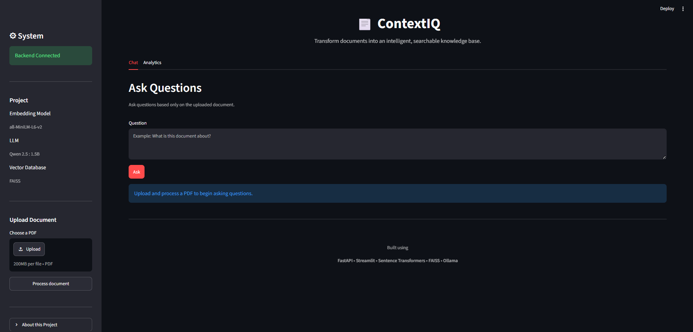
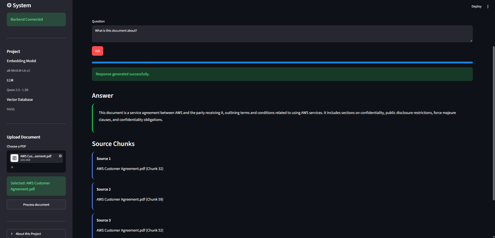
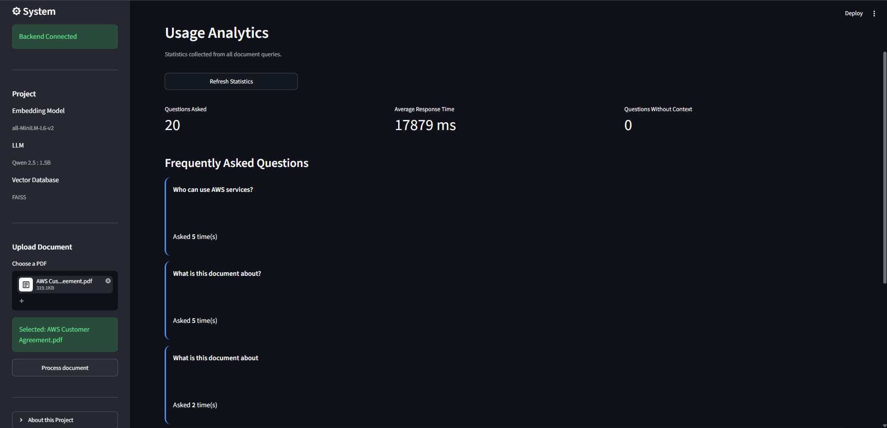

# ContextIQ

**RAG-based Document Q&A — ask questions, get answers grounded in your own PDFs, with full source attribution.**


-black)


ContextIQ lets you upload a PDF, ask questions in natural language, and get answers grounded **only** in that document — no hallucinated facts, no external knowledge, every answer traceable back to the exact chunk it came from.

---

## ✨ Highlights

- 📄 **Upload any PDF** → get a queryable knowledge base in seconds
- 🔍 **Source-attributed answers** — every response links back to its origin chunk, no black-box outputs
- 🖥️ **Fully local inference** — runs on Ollama, no data ever leaves your machine, no API costs
- 📊 **Built-in analytics dashboard** — tracks query volume, response time, and frequently asked questions
- 🧱 **End-to-end system, not a notebook demo** — ingestion pipeline, vector search, LLM inference, REST API, and frontend, all wired together

## Why I built this

Most portfolio projects show a single skill in isolation — a model here, a dashboard there. I wanted a project that reflects how AI-powered products are actually built end-to-end: ingestion pipeline, vector search, local LLM inference, backend API, and a usable frontend, working together as one system.

## Demo

**App overview**


**Ask a question, get a grounded, sourced answer**


**Analytics dashboard tracking real usage**


> In testing: 20 questions asked, 0 failed due to missing context, ~18s average response time on local CPU inference via a 1.5B model — see [Limitations](#limitations--future-work) for why this number matters.

---

## How It Works

```
PDF Upload
   ↓
Text Extraction (PyPDF)
   ↓
Text Chunking
   ↓
Embedding Generation (Sentence Transformers — all-MiniLM-L6-v2)
   ↓
FAISS Index Creation
   ↓
Question Embedding → Similarity Search → Context Retrieval
   ↓
Answer Generation (Ollama — Qwen2.5:1.5B)
   ↓
Response + Source Chunks
```

## Tech Stack

| Layer | Technology |
|---|---|
| Backend | FastAPI |
| Frontend | Streamlit |
| Embeddings | Sentence Transformers (`all-MiniLM-L6-v2`) |
| Vector Store | FAISS |
| LLM Inference | Ollama (Qwen2.5:1.5B, local) |
| Query Logging | SQLite |
| Validation | Pydantic |
| PDF Parsing | PyPDF |

---

## Quick Start

**1. Clone and enter the repo**
```bash
git clone <repository_url>
cd ContextIQ
```

**2. Create a virtual environment**

Windows:
```bash
python -m venv venv
venv\Scripts\activate
```

Linux / macOS:
```bash
python3 -m venv venv
source venv/bin/activate
```

**3. Install dependencies**
```bash
pip install -r requirements.txt
```

**4. Install Ollama** → download from [ollama.com](https://ollama.com)

**5. Pull the language model**
```bash
ollama pull qwen2.5:1.5b
```

**6. Configure environment**
```bash
copy .env.example .env
```
Default configuration:
```
LLM_PROVIDER=ollama
LLM_MODEL=qwen2.5:1.5b
OLLAMA_URL=http://localhost:11434/api/generate
```

**7. Run it**
```bash
ollama serve                              # terminal 1
uvicorn backend.main:app --reload         # terminal 2 → http://localhost:8000
streamlit run frontend/app.py             # terminal 3 → http://localhost:8501
```

## How to Use

1. Open the Streamlit app
2. Upload a PDF document
3. Click **Process document**
4. Enter a question about the document
5. View the answer along with the exact source chunks it was generated from
6. Check the **Analytics** tab for query statistics

---

## API Endpoints

| Method | Endpoint | Description |
|---|---|---|
| GET | `/health` | Health check |
| POST | `/ingest` | Upload and process a document |
| POST | `/ask` | Ask a question |
| GET | `/analytics` | Retrieve usage statistics |

## Project Structure

```
ContextIQ/
│
├── backend/
│   ├── data/
│   ├── database/
│   ├── rag/
│   ├── routers/
│   ├── services/
│   ├── vectorstore/
│   ├── config.py
│   ├── database.py
│   ├── main.py
│   └── schemas.py
│
├── frontend/
│   └── app.py
│
├── tests/
│
├── requirements.txt
├── README.md
├── .env.example
└── .gitignore
```

---

## Limitations & Future Work

- **Model size trade-off** — uses Qwen2.5:1.5B for fast local inference on modest hardware. This keeps the system fully local and free to run, but answer quality and response time (~18s average) trail larger hosted models. A configurable option to swap in a larger local or hosted model is a natural next step.
- **Single-document context** — currently answers from one ingested document at a time; multi-document retrieval is a planned extension.
- **No deployed demo yet** — currently local-only. Deploying the backend + frontend (e.g. Streamlit Community Cloud + a hosted API) is planned so reviewers can try it without local setup.
- **Chunking strategy** — uses fixed-size chunking; experimenting with semantic chunking could improve retrieval relevance.
- **No formal retrieval evaluation yet** — response time is logged, but retrieval precision/recall isn't yet benchmarked against a labeled question set — planned as a next step to quantify answer quality beyond "it works."

## Notes

- The backend must be running before starting the frontend
- Ollama must be running before asking questions
- A document must be ingested before questions can be answered
- The FAISS index and metadata are generated after successful ingestion
- The application answers only from the uploaded document and does not use external knowledge

## License

MIT — free to use, modify, and learn from.
